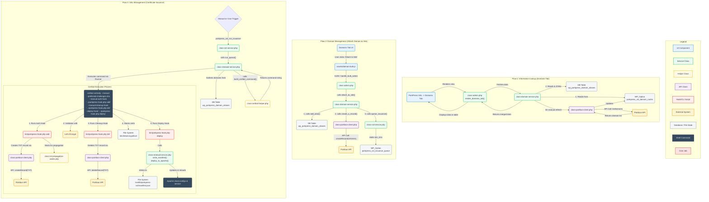

```mermaid
graph TD
    classDef ui fill:#e6f2ff,stroke:#3498db,stroke-width:2px;
    classDef service fill:#eafaf1,stroke:#2ecc71,stroke-width:2px;
    classDef helper fill:#fef9e7,stroke:#f1c40f,stroke-width:2px;
    classDef client fill:#f4ecf7,stroke:#9b59b6,stroke-width:2px;
    classDef script fill:#fdedec,stroke:#e74c3c,stroke-width:2px;
    classDef external fill:#fcf3cf,stroke:#f39c12,stroke-width:2px;
    classDef db fill:#f4f6f7,stroke:#95a5a6,stroke-width:2px;
    classDef shell fill:#34495e,color:#ecf0f1,stroke:#2c3e50,stroke-width:2px;
    classDef cron fill:#fde2e4,stroke:#e74c3c,stroke-width:2px;
    classDef flow_info fill:#e5e7e9,color:#000;
    classDef flow_domain fill:#e4fde9,color:#000;
    classDef flow_ssl fill:#e4f1fd,color:#000;

    subgraph Legend
        UI_L[UI Component]:::ui
        Service_L[Service Class]:::service
        Helper_L[Helper Class]:::helper
        Client_L[API Client]:::client
        Script_L[Hook/CLI Script]:::script
        External_L[External System]:::external
        DB_L[Database / File State]:::db
        Shell_L[Shell Command]:::shell
        Cron_L[Cron Job]:::cron
    end

    subgraph "Flow 1: Information Lookup (Domains Tab)"
        direction LR
        INFO_AdminPage("PorkPress SSL -> Domains Tab"):::ui
        INFO_AdminPage -- "Renders view" --> INFO_AdminClass("class-admin.php<br>render_domains_tab()"):::service
        INFO_AdminClass -- "Fetches data" --> INFO_DomainService("class-domain-service.php"):::service
        INFO_DomainService -- "1. Reads from" --> INFO_DomainCache("WP_Option<br>porkpress_ssl_domain_cache"):::db
        INFO_DomainService -- "2. Reads & JOINs" --> INFO_AliasTable("DB Table<br>wp_porkpress_domain_aliases"):::db
        INFO_DomainService -- "On manual refresh" --> INFO_PorkbunClient("class-porkbun-client.php"):::client
        INFO_PorkbunClient -- "API Call: listDomains" --> INFO_PorkbunAPI("Porkbun API"):::external
        INFO_PorkbunAPI -- "Returns domain list" --> INFO_PorkbunClient
        INFO_PorkbunClient -- "Updates" --> INFO_DomainCache
        INFO_DomainService -- "Returns merged data" --> INFO_AdminClass
        INFO_AdminClass -- "Displays data in table" --> INFO_AdminPage
    end

    subgraph "Flow 2: Domain Management (Attach Domain to Site)"
        direction TB
        DOM_AdminPage("Domains Tab UI"):::ui
        DOM_AdminPage -- "User clicks 'Attach to Site'" --> DOM_JS("assets/domain-bulk.js"):::ui
        DOM_JS -- "AJAX: handle_bulk_action" --> DOM_AdminClass("class-admin.php"):::service
        DOM_AdminClass -- "calls attach_to_site()" --> DOM_DomainService("class-domain-service.php"):::service
        DOM_DomainService -- "1. calls add_alias()" --> DOM_AliasTable("DB Table<br>wp_porkpress_domain_aliases"):::db
        DOM_DomainService -- "2. calls create_a_record()" --> DOM_PorkbunClient("class-porkbun-client.php"):::client
        DOM_PorkbunClient -- "API Call: createRecord(A/AAAA)" --> DOM_PorkbunAPI("Porkbun API"):::external
        DOM_DomainService -- "3. calls queue_issuance()" --> DOM_SSLService("class-ssl-service.php"):::service
        DOM_SSLService -- "Adds site_id to" --> DOM_SSLQueue("WP_Option<br>porkpress_ssl_issuance_queue"):::db
    end

    subgraph "Flow 3: SSL Management (Certificate Issuance)"
        direction TB
        SSL_Trigger{Manual or Cron Trigger}
        subgraph Certbot Execution Process
            direction TB
            SSL_CertbotCmd("certbot certonly --manual<br>--preferred-challenges dns<br>--manual-auth-hook '.../porkpress-hook.php add'<br>--manual-cleanup-hook '.../porkpress-hook.php del'<br>--deploy-hook '.../porkpress-hook.php deploy'"):::shell
            SSL_CertbotCmd -- "1. Runs Auth Hook" --> SSL_HookScriptAdd("bin/porkpress-hook.php add"):::script
            SSL_HookScriptAdd -- "Creates TXT record via" --> SSL_PorkbunClient_A("class-porkbun-client.php"):::client
            SSL_PorkbunClient_A -- "API: createRecord(TXT)" --> SSL_PorkbunAPI_A("Porkbun API"):::external
            SSL_HookScriptAdd -- "Waits for propagation" --> SSL_TxtWaiter("class-txt-propagation-waiter.php"):::helper

            SSL_CertbotCmd -- "2. Validates with" --> SSL_LetsEncrypt("Let's Encrypt"):::external

            SSL_CertbotCmd -- "3. Runs Cleanup Hook" --> SSL_HookScriptDel("bin/porkpress-hook.php del"):::script
            SSL_HookScriptDel -- "Deletes TXT record via" --> SSL_PorkbunClient_B("class-porkbun-client.php"):::client
            SSL_PorkbunClient_B -- "API: deleteRecord(TXT)" --> SSL_PorkbunAPI_B("Porkbun API"):::external

            SSL_CertbotCmd -- "4. Stores certs" --> SSL_CertFiles("File System<br>/etc/letsencrypt/live/"):::db

            SSL_CertbotCmd -- "5. Runs Deploy Hook" --> SSL_HookScriptDeploy("bin/porkpress-hook.php deploy"):::script
            SSL_HookScriptDeploy -- "Calls" --> SSL_RenewalService_B("class-renewal-service.php<br>write_manifest()<br>deploy_to_apache()"):::service
            SSL_RenewalService_B -- "Writes to" --> SSL_Manifest("File System<br>/var/lib/porkpress-ssl/manifest.json"):::db
            SSL_RenewalService_B -- "Updates & reloads" --> SSL_Apache("Apache vhost configs & service"):::shell
        end
        SSL_Trigger -- "porkpress_ssl_run_issuance" --> SSL_SSLService("class-ssl-service.php"):::service
        SSL_SSLService -- "calls run_queue()" --> SSL_RenewalService_A("class-renewal-service.php"):::service
        SSL_RenewalService_A -- "Gathers domains from" --> SSL_AliasTable("DB Table<br>wp_porkpress_domain_aliases"):::db
        SSL_RenewalService_A -- "calls build_certbot_command()" --> SSL_CertbotHelper("class-certbot-helper.php"):::helper
        SSL_CertbotHelper -- "Returns command string" --> SSL_RenewalService_A
        SSL_RenewalService_A -- "Executes command via Runner" --> SSL_CertbotCmd
    end
```
